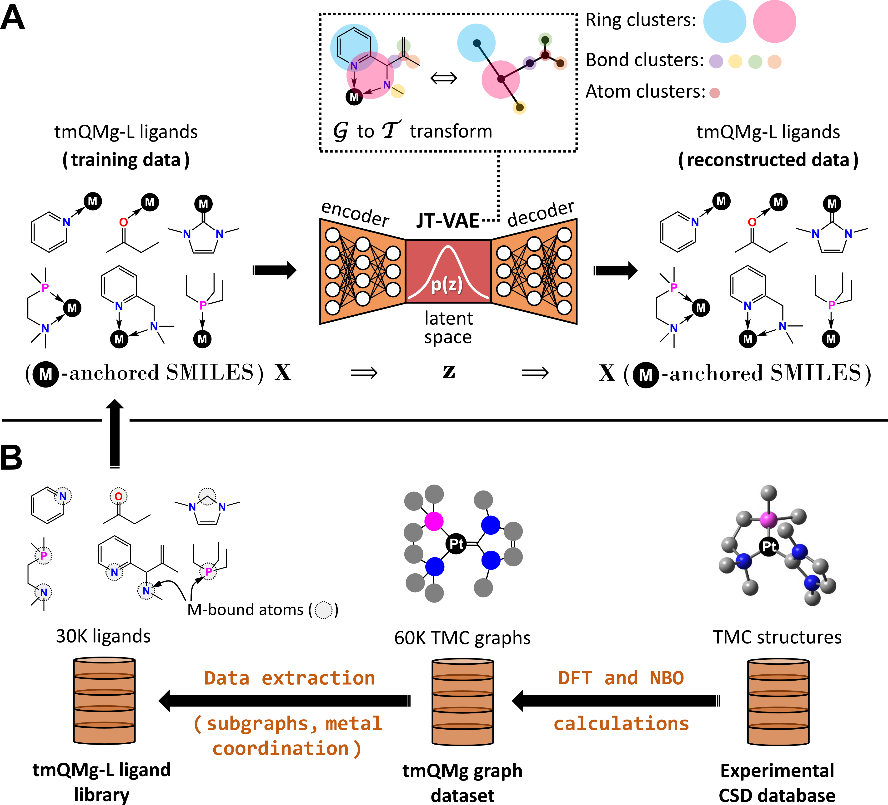

# tmcinvdes

Public repository for the preprint ["Deep Generative Model for the Dual-Objective Inverse Design of Metal Complexes."](https://doi.org/10.26434/chemrxiv-2024-mzs7b)

`tmcinvdes` will provide code and data from our research around junction tree variational autoencoder (JT-VAE) models that can generate metal ligands for transition metal complexes (TMCs). TMCs are used in industrial catalytic processes, anticancer therapies, and energy transformations. By labeling ligands with DFT-calculated target properties, conditional generative models can be trained and harnessed, optimizing metal ligands directionally in the target property space to discover novel, useful **TMC**s by **inv**erse **des**ign.

The fork used to train the models can be found at: [FastJTNNpy3](https://github.com/Strandgaard96/FastJTNNpy3). All script used to train the models and perform conditional optimization can be found in the fork.

## Code

All code should be run in a python environment defined by the [environment.yml](environment.yml) file.
The code also relies on a local download of the [tmQMg-L](https://github.com/hkneiding/tmQMg-L.git) repository.

[Ligand generation](/tmcinvdes/ligand_generation)

Contains the code used to create the JT-VAE training sets.

[Quantum chemistry](/tmcinvdes/quantum_chemistry)

Contains the ORCA input files and parser scripts to label the generated ligands

### Work in Progress

This repository represents work in progress, meaning that data and code will be gradually added.
