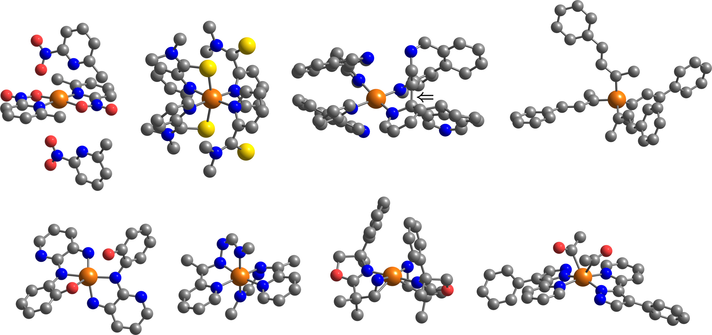

<par></par>

## Outliers

We observed geometric distortions in 63% and 14% of the $[\mathrm{Ir} \mathrm{L}_4]^+$ and $[\mathrm{Ir} \mathrm{L}_2]^+$ outliers, respectively. These do not include the TMCs with ligands missing H atoms, which are 11% in both series. These features appear in the comment line of each TMC entry in the monodentate and bidentate `.xyz` files in this folder.

The identifiers of the DFT-labeled TMCs shown in the figure above (Figure S8 of the SI) are as follows:

$[\mathrm{Ir} \mathrm{L}_4]^+$ top row, left to right, identifed simply as `{Label ID}`: 3886, 4994, 6876, and 3490.

$[\mathrm{Ir} \mathrm{L}_2]^+$ bottom row, left to right, identified as `{Ligand ID}-{Isomer}`: uncond_bi-min10k-1518-trans, uncond_bi-min10k-1812-trans, uncond_bi-min10k-8929-trans, uncond_bi-min10k-7426-trans.

Both sets of outliers were extracted with the isolation forest method with contamination parameters 0.010 ($[\mathrm{Ir} \mathrm{L}_4]^+$) and 0.015 ($[\mathrm{Ir} \mathrm{L}_2]^+$).
